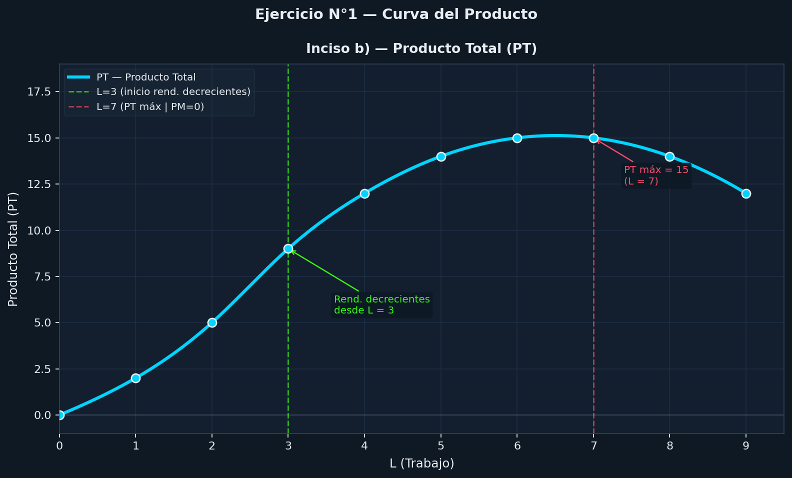
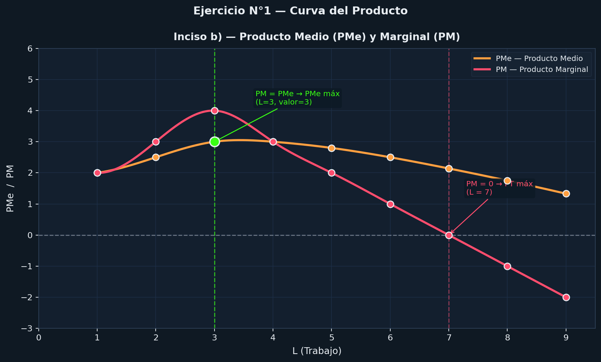

# Guía 3 - Ejercicio 1

## Enunciado

Determine el producto promedio (PP) o producto medio (PMe) y el producto marginal (PM) del factor trabajo

| Tierra | Trabajo (L) | Producto (PT) |
|--------|-------------|---------------|
|   1    |     0       |       0       |
|   1    |     1       |       2       |
|   1    |     2       |       5       |
|   1    |     3       |       9       |
|   1    |     4       |      12       |
|   1    |     5       |      14       |
|   1    |     6       |      15       |
|   1    |     7       |      15       |
|   1    |     8       |      14       |
|   1    |     9       |      12       |

Producto Medio (PMe)
"cuanto produce cada trabajador en promedio"

```math
PMe = \frac{PT}{L}
```

Producto Marginal (PM)
"Cuando aumenta la producción al agregar 1 trabajador"

```math
PM = \frac{\Delta PT}{\Delta L}
```

## a

### Producto Medio (PMe)

| L | PT | PMe = PT/L    |
| - | -- | ------------- |
| 1 | 2  | 2/1 = 2       |
| 2 | 5  | 5/2 = 2,5     |
| 3 | 9  | 9/3 = 3       |
| 4 | 12 | 12/4 = 3      |
| 5 | 14 | 14/5 = 2,8    |
| 6 | 15 | 15/6 = 2,5    |
| 7 | 15 | 15/7 ≈ 2,14   |
| 8 | 14 | 14/8 = 1,75   |
| 9 | 12 | 12/9 = 1,33   |

___

### Producto Marginal (PM)

| L | PT | PM           |
| - | -- | ------------ |
| 1 | 2  | 2 - 0 = 2    |
| 2 | 5  | 5 - 2 = 3    |
| 3 | 9  | 9 - 5 = 4    |
| 4 | 12 | 12 - 9 = 3   |
| 5 | 14 | 14 - 12 = 2  |
| 6 | 15 | 15 - 14 = 1  |
| 7 | 15 | 15 - 15 = 0  |
| 8 | 14 | 14 - 15 = -1 |
| 9 | 12 | 12 - 14 = -2 |

## b graficos

### Producto Total (PT)



___

### Producto Promedio (PMe) y Producto Marginal (PM)



___

## c

- Rendimientos decrecientes empiezan en:
    L = 3
- Producción decreciente empieza en:
    L = 6 y L = 7 (≈ 6,5)
