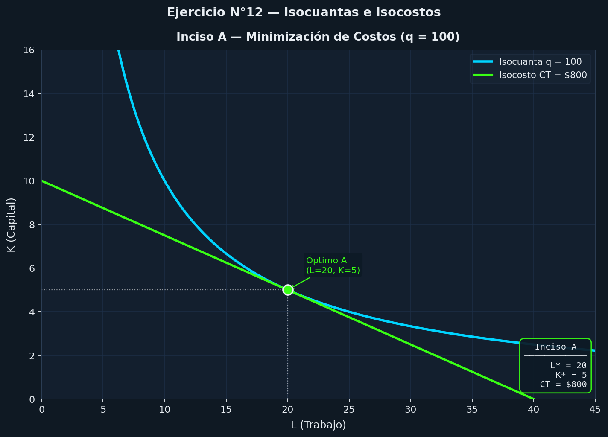
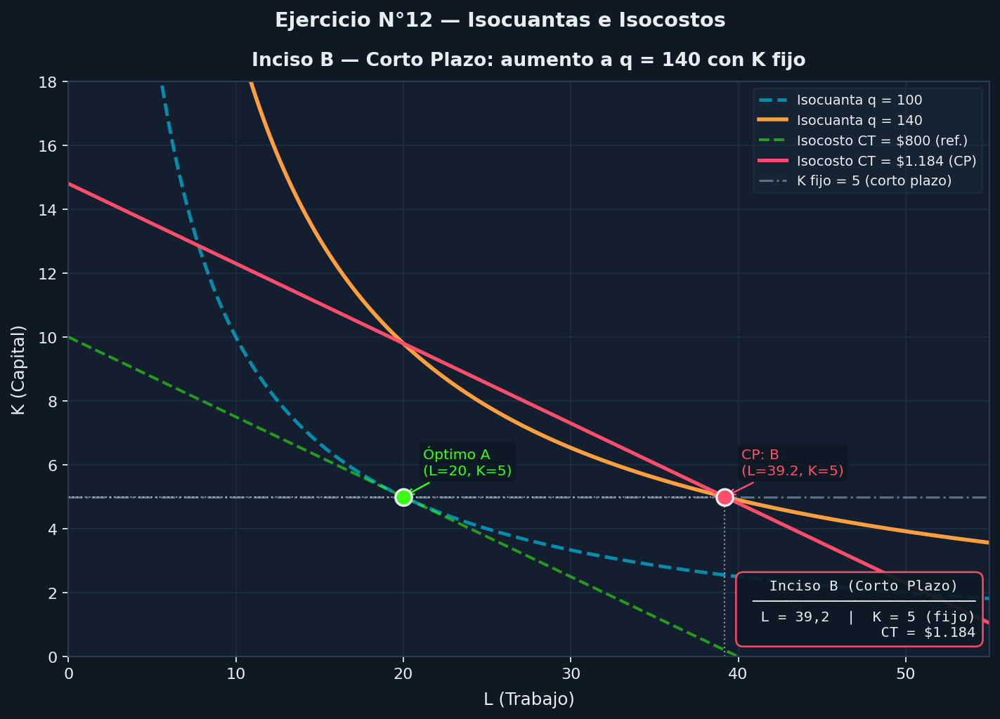
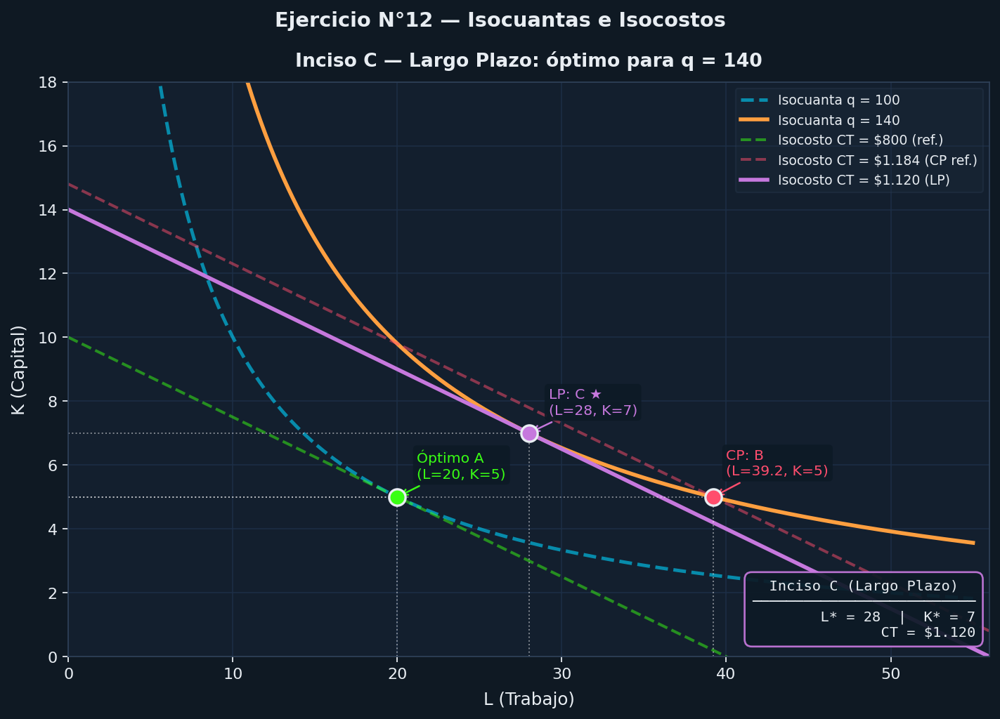

# Guía 3 Ejercicio 12

## Datos del ejercicio

Función de producción:

```math
q = 10L^0.5K^0.5
```

Precios:

- w = 20 (Precio del trabajo)
- r = 80 (Precio del capital)

## a) La empresa está produciendo actualmente 100 unidades de producción y ha decidido que las cantidades de trabajo y de capital minimizadoras de los costos son 20 y 5, respectivamente. Muéstrelo gráficamente utilizando isocuantas y rectas isocostos

>*Ídea clave* --> La empresa **minimiza costos** cuando:

```math
\frac{PM_L}{PM_K} = \frac{w}{r}
```

Cita: *"Esto significa que el u ltimo peso gastado en trabajo y en capital debe aportar la misma produccio n adicional."*
> Fuente: Apunte de Producción y Costos, pág. 15

Recordemos que la función de producción es:

```math
q = 10L^{0.5}K^{0.5}
```

**Paso 1:** Derivamos la función de producción para obtener los productos marginales

```math
PM_L = \frac{\partial q}{\partial L} = 5L^{-0.5}K^{0.5}
```

```math
PM_K = \frac{\partial q}{\partial K} = 5L^{0.5}K^{-0.5}
```

**Paso 2:** Calculamos la relación de los productos marginales

```math
\frac{PM_L}{PM_K} = \frac{5L^{-0.5}K^{0.5}}{5L^{0.5}K^{-0.5}} = \frac{K}{L}
```

**Paso 3:** Igualamos con los precios

```math
\frac{K}{L} = \frac{20}{80} = \frac{1}{4} \\\ \\\
K=\frac{L}{4}
```

**Paso 4:** Sustituimos en la función de producción para encontrar la cantidad de trabajo

```math
100 = 10L^{0.5} ​⋅ \left(\frac{L}{4}\right)^{0.5} \\\ \\\
100 = 10L^{0.5}​ ⋅ L^{0.5}​ ⋅ 4^{-0.5} \\\ \\\
100 = 10L​ ⋅ 4^{-0.5} \\\ \\\
10 = L \cdot 4^{-0.5} \\\ \\\
L = 10 \cdot 4^{0.5} \\\ \\\
L = 10 \cdot 2 \\\  \\\
L = 20
```

**Paso 5:** Sustituimos el valor de L para encontrar la cantidad de capital

```math
K = \frac{L}{4} = \frac{20}{4} = 5
```

*Respusta:*

Recordando que TMST es la tasa marginal de sustitución técnica, tenemos que:
CITA {
(RMST) (o tasa marginal de sustitucio n te cnica TMST)
RMST = – variacio n de la cantidad de capital/variacio n de la cantidad de trabajo
= –ΔK/ΔL (manteniendo fijo el nivel de q)
}

```math
RMST = TMST = - \frac{PM_L}{PM_K} = - \frac{20}{80} = - \frac{1}{4} = -0.25
```

Costo total:

```math
CT = wL + rK = 20​ ⋅ (20) + 80​ ⋅ (5) = 400 + 400 = 800
```

### Grafico: Isocuantas y rectas isocostos



____

## b) Ahora la empresa quiere aumentar la producción a 140 unidades. Si el capital es fijo a corto plazo, ¿cuánto trabajo necesitará la empresa? Muéstrelo gráficamente y halle el nuevo costo total de la empresa

>*Ídea clave* --> En corto plazo, no se puede cambiar la cantidad de capital, por lo que K = 5.

Cita: *"A corto plazo, al menos uno de los factores es fijo —usualmente, el capital— y la empresa solo puede ajustar el uso del factor variable, como el trabajo."*
> Fuente: Apunte de Producción y Costos, pág. 2

*Paso 1:* Reemplazamos en la función de producción para encontrar la cantidad de trabajo necesaria

```math
140 = 10L^{0.5} ​⋅ (5)^{0.5} \\\ \\\
14 = L^{0.5}​ ⋅ (5)^{0.5} \\\ \\\
L^{0.5} = \frac{14}{(5)^{0.5}} \\\ \\ \\\
L = \left(\frac{14}{(5)^{0.5}}\right)^2 \\\ \\\
L = \frac{196}{5} = 39.2 \\\ \\\
L \approx 39
```

*Paso 2:* Calculamos el nuevo costo total

```math
CT = wL + rK = 20​ ⋅ (39.2) + 80​ ⋅ (5) = 784 + 400 = 1184
```

### Grafico: Corto Plazo



____

## c) dentifique gráficamente el nivel de capital y de trabajo que minimiza el costo a largo plazo si la empresa quiere producir 140 unidades

>*Ídea clave* --> En largo plazo, la empresa puede ajustar tanto el trabajo como el capital para minimizar costos.

Cita: *"En cambio, a largo plazo todos los factores pueden modificarse, permitiendo ajustar el taman o de la planta y la estructura productiva"*
> Fuente: Apunte de Producción y Costos, pág. 2

Usamos lo que encontramos en el punto a) para encontrar la relación entre K y L que minimiza costos:

```math
K = \frac{L}{4}
```

*Paso 1:* Reemplazamos en la función de producción para encontrar la cantidad de trabajo necesaria

```math
140 = 10L^{0.5} ​⋅ \left(\frac{L}{4}\right)^{0.5} \\\ \\\
140 = 10L^{0.5}​ ⋅ L^{0.5}​ ⋅ 4^{-0.5} \\\ \\\
140 = 10L​ ⋅ 4^{-0.5} \\\ \\\
14 = L \cdot 4^{-0.5} \\\ \\\
L = 14 \cdot 4^{0.5} \\\ \\\
L = 14 \cdot 2 \\\ \\\
L = 28
```

*Paso 2:* Sustituimos el valor de L para encontrar la cantidad de capital

```math
K = \frac{L}{4} = \frac{28}{4} = 7
```

*Paso 3:* Calculamos el nuevo costo total

```math
CT = wL + rK = 20​ ⋅ (28) + 80​ ⋅ (7) = 560 + 560 = 1120
```

> Obs: Es menor que el costo total en **corto plazo**, lo cual es consistente con la idea de que en **largo plazo** la empresa puede ajustar ambos factores para minimizar costos.

### Grafico: Largo Plazo



____

## d) Si la relación marginal de sustitución técnica es K/L, halle el nivel óptimo de capital y de trabajo necesario para producir las 140 unidades

Ya nos dice que la relación marginal de sustitución técnica es K/L, lo cual es consistente con lo que encontramos en el punto a):

```math
\frac{PM_L}{PM_K} = \frac{K}{L}
```

Entonces tenemos que:

```math
\frac{K}{L} = \frac{20}{80} = \frac{1}{4} \\\ \\\
K = \frac{L}{4}
```

Reemplazamos en la función de producción para encontrar la cantidad de trabajo necesaria:

```math
140 = 10L^{0.5} ​⋅ \left(\frac{L}{4}\right)^{0.5} \\\ \\\
140 = 10L^{0.5}​ ⋅ L^{0.5}​ ⋅ 4^{-0.5} \\\ \\\
140 = 10L​ ⋅ 4^{-0.5} \\\ \\\
14 = L \cdot 4^{-0.5} \\\ \\\
L = 14 \cdot 4^{0.5} \\\ \\\
L = 14 \cdot 2 \\\ \\\
L = 28
```

Sustituimos el valor de L para encontrar la cantidad de capital:

```math
K = \frac{L}{4} = \frac{28}{4} = 7
```
