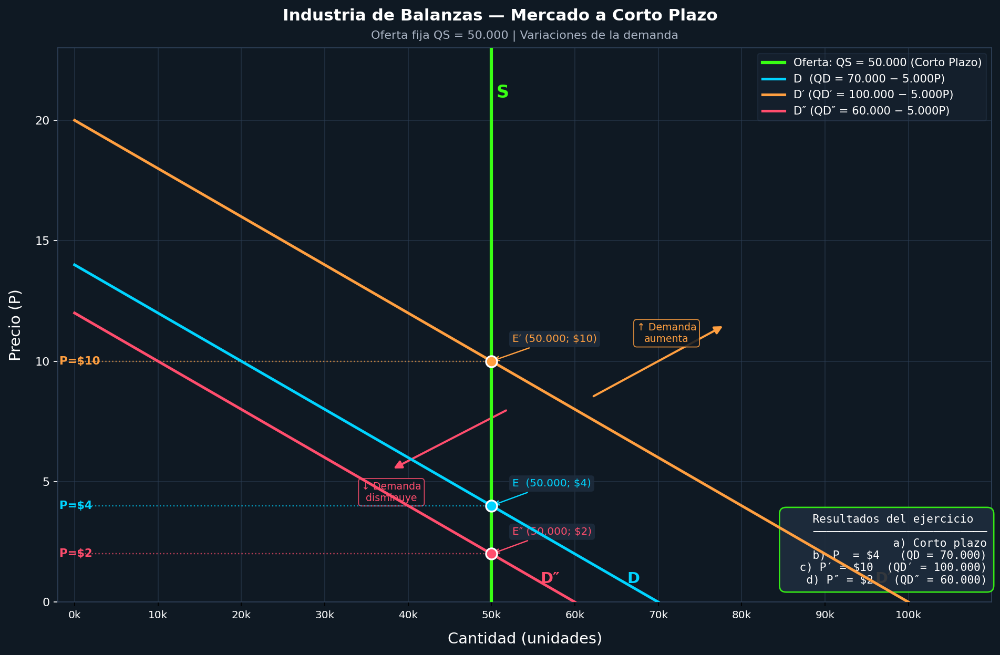

# Guía 4 - Ejercicio 4

## Idea General

Tenemos:
    - Oferta **QS** = 50.000u.
    - Demanda = **cambia en cada inciso.**
    - Objetivo: Encontrar el precio de equilibrio.

Regla clave:
En equilibrio: **Oferta = Demanda.**

Cito: *"precio de equilibrio(o que vacía el mercado). Precio al que la cantidad ofrecida y la demandada son iguales"*
> Cap. 2 Pág. 28/Pág. 64 de "microeconomia_pyndick"

---

## a) ¿Se trata del periodo del mercado, a corto o a largo plazo?

La oferta es: *QS = 50.000u*

Esto significa:

- La cantidad NO depende del precio
- Siempre se producen 50.000 unidades

Traducción simple:
La cantidad está “fija”

Entonces, como la cantidad **no puede cambiar**, estamos en: **Corto Plazo**

Citando: *"A corto plazo, la empresa opera con una cantidad fija de capital y debe decidir el nivel de utilización de sus factores variables con el objetivo de maximizar los beneficios"*

> Pág. 4 de "Competencia Perfecta"

---

## b) Si la demanda del mercado está dada por QD = 70.000 – 5.000P, y P se expresa en unidades monetarias, ¿Cuál es el precio de equilibrio del mercado (P)?

Demanda: *QD = 70.000 – 5.000P*

**Paso 1:** Igualar Oferta y Demanda

```md
QS = QD
50.000 = 70.000 – 5.000P
```

**Paso 2:** Despejar P

```md
5.000P = 70.000 – 50.000
5.000P = 20.000
P = 20.000 / 5.000
P = $4
```

---

## c) Si la función de demanda del mercado cambia a QD′ = 100.000 – 5.000P, ¿Cuál es el nuevo precio de equilibrio del mercado (P′)?

Demanda: *QD′ = 100.000 – 5.000P*

**Paso 1:** Igualar Oferta y Demanda

```md
QS = QD′
50.000 = 100.000 – 5.000P
```

**Paso 2:** Despejar P

```md
5.000P = 100.000 – 50.000
5.000P = 50.000
P = 50.000 / 5.000
P = $10
```

---

## d) Si la función de demanda del mercado cambia a QD″ = 60.000 – 5.000P, ¿Cuál es el nuevo precio de equilibrio del mercado (P″)?

Demanda: *QD″ = 60.000 – 5.000P*

**Paso 1:** Igualar Oferta y Demanda

```md
QS = QD″
50.000 = 60.000 – 5.000P
```

**Paso 2:** Despejar P

```md
5.000P = 60.000 – 50.000
5.000P = 10.000
P = 10.000 / 5.000
P = $2
```

---

## e) Dibuje un gráfico que muestre cada una de las variaciones


