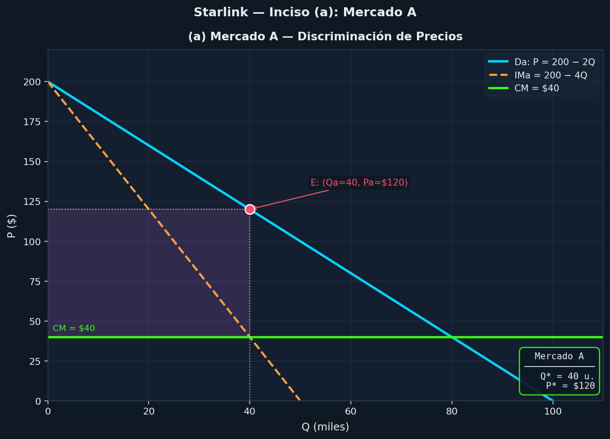
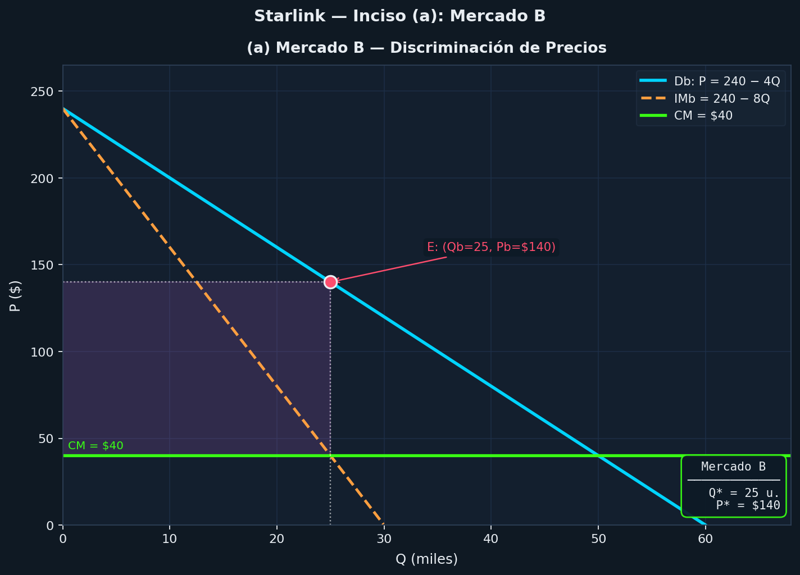
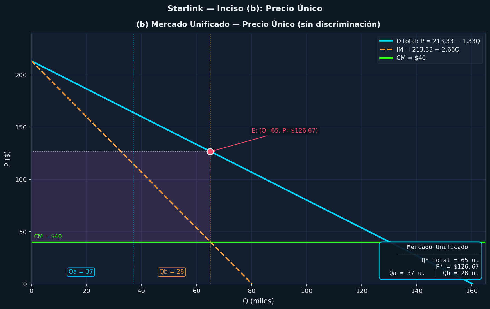

# Guía 5 - Ejercicio 3

## Datos del Ejercicio

Demandas (dos mercados distintos):

- Mercado A: **Q<sub>a</sub> = 100 - 0.5P<sub>a</sub>**
- Mercado B: **Q<sub>b</sub> = 60 - 0.25P<sub>b</sub>**

Costo: **C = 1000 + 40Q** , donde **Q = Q<sub>a</sub> + Q<sub>b</sub>**

## Ídea clave

Como hay **2 mercados separados**, esto es **discriminación de precios de tercer grado**, por lo que la empresa puede cobrar un precio distinto en cada mercado.

Cita: *"La discriminación de precios de tercer grado es la forma más extendida y consiste en dividir a los consumidores en grupos distintos, cada uno con su propia curva de demanda, y cobrar un precio diferente a cada grupo"*
> Página 15 del pdf "Mercados Monopólicos"

Para maximizar beneficios… deben cumplirse dos condiciones:

- Igualdad de ingresos marginales entre grupos: **IM₁ = IM₂ = … = IM<sub>n</sub>**
- Igualdad entre ingreso marginal y coste marginal: **IM₁ = IM₂ = … = CM”**

> Página 15 del pdf "Mercados Monopólicos"

## a) ¿Cuáles son los precios y las cantidades que maximizan los beneficios en los dos mercados?

**Paso 1:** Pasar demandas a función de precio
Depejamos el precio de cada mercado:

- Mercado A

```Math
Qₐ = 100 - 0.5Pₐ \\\
0.5Pₐ = 100 - Qₐ \\\
Pₐ = 200 - 2Qₐ
```

- Mercado B

```math
Q_b = 60 - 0.25P_b \\\
0.25P_b = 60 - Q_b \\\
P_b = 240 - 4Q_b
```

**Paso 2:** Calcular ingresos marginales de cada mercado (IM)

> Recordar: en demanda lineal -> misma ordenada, doble pendiente

Cita: *"En el caso de una demanda lineal, la curva de ingreso marginal es una recta con la misma ordenada al origen que la demanda, pero con una pendiente del doble en valor absoluto."*

Ingreso total: **IT = P ⋅ Q** , para el ingreso marginal hacemos: **IM = dIT / dQ**​

- Mercado A:

Sabiendo que **Pₐ = 200 - 2Qₐ**

```math
ITₐ = Pₐ ⋅ Qₐ \\\
IT_a= (200 - 2Q_a) ⋅ Qₐ \\\
IT_a = 200Qₐ - 2Qₐ^2 \\\
```

Ahora derivamos respecto a Qₐ:

```math
IMₐ = dITₐ / dQₐ \\\
IM_a = 200 - 4Qₐ
```

- Mercado B:

Sabiendo que **P_b = 240 - 4Q_b**

```math
IT_b = P_b ⋅ Q_b \\\
IT_b = (240 - 4Q_b) ⋅ Q_b \\\
IT_b = 240Q_b - 4Q_b^2 \\\
```

Ahora derivamos respecto a Qᵦ:

```math
IM_b = dIT_b / dQ_b \\\
IM_b = 240 - 8Q_b
```

**Paso 3:** Costo marginal (CM)

Recordar que el costo total es: **C = 1000 + 40Q** , por lo que el costo marginal es:

```math
CM = dC / dQ \\\
CM = 40
```

**Paso 4:** Igualar ingresos marginale y costo marginal para cada mercado:

- Mercado A:

```math
IMₐ = CM \\\
200 - 4Qₐ = 40 \\\
160 = 4Qₐ \\\
Qₐ = 40u
```

- Mercado B:

```math
IM_b = CM \\\
240 - 8Q_b = 40 \\\
200 = 8Q_b \\\
Q_b = 25u
```

**Paso 5:** Calcular precios de cada mercado

- Mercado A:

```math
Pₐ = 200 - 2Qₐ \\\
Pₐ = 200 - 2(40) \\\
Pₐ = 120
```

- Mercado B:

```math
P_b = 240 - 4Q_b \\\
P_b = 240 - 4(25) \\\
P_b = 140
```

Respuesta:

- Mercado A: **Pₐ = $120** , **Qₐ = 40u**
- Mercado B: **P_b = $140** , **Q_b = 25u**

____

## b) Como consecuencia de un nuevo satélite puesto en órbita recientemente por el Pentágono, la población de A recibe las emisiones satelitales de B y B recibe las de A. Como consecuencia, cualquier residente de A o B puede recibir las emisiones suscribiéndose en cualquiera de las dos zonas. ¿Qué precio debe cobrar y qué cantidades venderá en A y B?

Los mercados se mezclan -> una **sola demanda**

**Paso 1:** Sumar demandas

```math
Q = Qₐ + Q_b \\\
Q = (100 - 0.5P) + (60 - 0.25P) \\\
Q = 160 - 0.75P \\\ 
0.75P = 160 - Q \\\ \\\
```

**Paso 2:** Pasar demanda a función de precio

```math
P = \frac{160 - Q}{0.75} \\\ \\\
P = 213.33 - 1.33Q
```

**Paso 3:** Calcular ingreso marginal (IM)

```math
IT = P ⋅ Q \\\
IT = (213.33 - 1.33Q) ⋅ Q \\\
IT = 213.33Q - 1.33Q^2 \\\
```

Derivamos respecto a Q:

```math
IM = dIT / dQ \\\
IM = 213.33 - 2.66Q
```

**Paso 4:** Igualar ingreso marginal y costo marginal

```math
IM = CM \\\
213.33 - 2.66Q = 40 \\\
173.33 = 2.66Q \\\
Q = 65.17u
```

**Paso 5:** Calcular precio

```math
P = 213.33 - 1.33Q \\\
P = 213.33 - 1.33(65.17) \\\
P = 126.67
```

**Paso 6:** Calcular cantidades vendidas en cada mercado

- Mercado A:

```math
Qₐ = 100 - 0.5P \\\
Qₐ = 100 - 0.5(126.67) \\\
Qₐ = 36.67u \approx 37u
```

- Mercado B:

```math
Q_b = 60 - 0.25P \\\
Q_b = 60 - 0.25(126.67) \\\
Q_b = 28.33u \approx 28u
```

Respuesta:

- Precio: **P = $126.67**
- Mercado A: **Qₐ = 37u**
- Mercado B: **Qᵦ = 28u**
- Total unidades vendidas: **Q = 65u**

____

## c) ¿En cuál de las situaciones anteriores a) o b), disfruta la Empresa de bienestar mayor?

Tenemos dos opciones:

- **Caso a) discriminación de precios de tercer grado:**
  - Mercado A: **Pₐ = $120**
  - Mercado B: **P_b = $140**

Esto signifca que a cada mercado se le cobra un precio distinto
En cada mercado cobra el precio que más le conviene a cada mercado, por lo que el beneficio es mayor

**¿Qué logra con esto?**
La empresa:

- Cobra **más caro** donde la demanda es **menos elástica** (mercado B)
- Cobra **más barato** donde la demanda es **más elástica** (mercado A)
- Vende **más unidades** en total **bien distribuidas** entre ambos mercados

Lo que resulta en una **captura más excedente del consumidor**, lo que se traduce en un mayor beneficio para la empresa.

Cita: *"De este modo, el precio ma s alto se cobra al grupo cuya demanda es menos ela stica, lo cual refleja mayor disposicio n a pagar."*
> Página 16 del pdf "Mercados Monopólicos"

- **Caso b) mezcla de mercados:**
  - Precio: **P = $126.67**

Problemas:

- En el mercado B -> está cobrando un precio **más barato** de lo que podría cobrar.
- En el mercado A -> está cobrando un precio **más caro** de lo que podría cobrar.

Esto hace que el beneficio sea menor, ya que no está maximizando el precio en cada mercado.

**Conclusión:**

- En (a) -> la empresa optimiza cada mercado por separado, lo que le permite capturar más excedente del consumidor y obtener un mayor beneficio.
- En (b) -> la empresa **no** optimiza cada mercado por separado, usa una solución "intermedia" que no maximiza el beneficio en ninguno de los mercados, lo que resulta en un menor beneficio total.

Por lo cual:

```md
    Beneficio en (a) > Beneficio en (b)
```

____

### Versión más simple de la respuesta a la pregunta c)

"La empresa gana más en **(a)** porque al discriminar precios puede adaptarse a cada demanda y capturar mayor excedente, cosa que no puede hacer con precio único."

____

## Graficos

### inciso a)

#### Mercado A



#### Mercado B



____

### inciso b)


