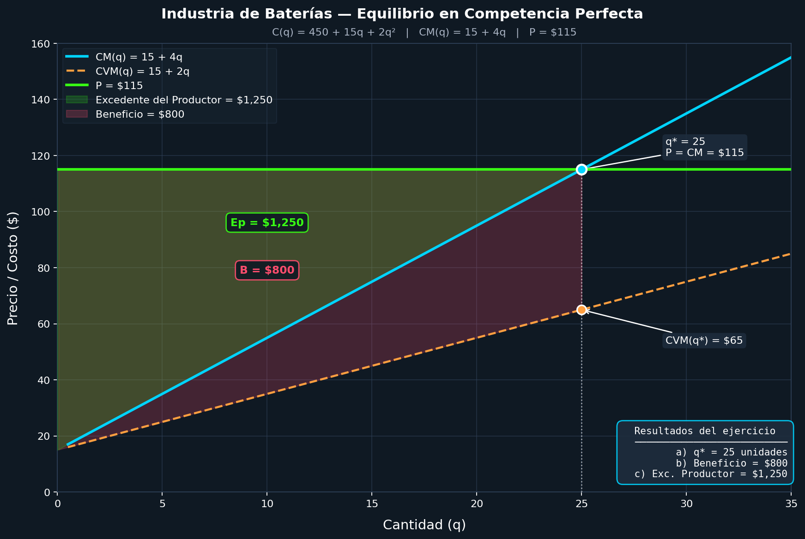

# Guia 4: Ejercicio 2

## Datos del Ejercicio

Función de costo total:

```md
C(q) = 450 + 15q + 2q²
```

> Donde *q* es la cantidad producida. (q esta elevada 2)

Costo Marginal:

```md
CM(q) = 15 + 4q
```

Precio del Mercado:

```md
P = 115
```

### a) Si el precio de mercado es P = $115 por unidad, calcule el nivel de producción de la empresa

Idea clave (esto es lo más importande de todo):
En **competencia perfecta**, la empresa elige *q* tal que:

```md
P = CM
```

> Porque ahí maximiza beneficios

Aplicamos:

```math
115 = 15 + 4q
100 = 4q
q = 25
```

### b)   Halle el nivel de beneficios

**Paso 1:** Ingreso Total

```md
IT = P ⋅ q = 115 ⋅ 25 = 2875
```

**Paso 2:** Costo Total

```md
C(25) = 450 + 15(25) + 2(25)^2
= 450 + 375+ 1250
= 2075
```

**Paso 3:** Beneficio

```md
π = IT − C
π = 2875 − 2075 = 800
```

### c) Obtenga el nivel de excedente del productor

> Hay dos formas de resolver este punto, una es de forma analítica y la otra es de forma gráfica. Vamos a resolverlo de ambas formas.

Teniendo en cuenta que la definición de excedente del productor es:
***"El excedente del productor es el área entre el precio de mercado y la curva de costo marginal."***

Podemos plantear la siguiente integral para calcular el excedente del productor:

```md
EP = ∫(P - CM(q)) dq
```

Resolvemos la integral con los límites de 0 a 25:

```md
EP = ∫₀²⁵(115 - (15 + 4q)) dq
EP = ∫₀²⁵(100 - 4q) dq
EP = [100q - 2q^2]₀²⁵
EP = (100(25) - 2(25)^2) - (100(0) - 2(0)^2)
EP = (2500 - 1250) - 0
EP = 1250
```

## Grafico



Para punto c, resolver de forma gráfica:

Datos:
Precio: 115
CM empieza en 15
Cantidad: 25

Altura del triángulo:
115 − 15 = 100

Base:
25

Área:
EP = 1/2 ⋅ 25 ⋅ 100 = 1250
